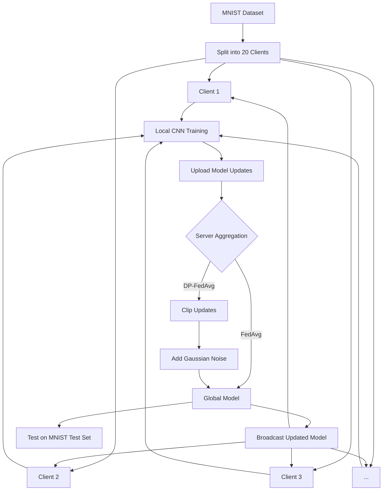

# 🔒 Privacy-Preserving Image Classification using Federated Learning and Differential Privacy

<p align="center">


</p>

A privacy-preserving image classification system built using **Federated Learning (FL)** and **Differential Privacy (DP)** on the **MNIST handwritten digit dataset**.

Instead of collecting users' data on a central server, this project simulates distributed client devices that train a shared Convolutional Neural Network (CNN) locally. The server aggregates only model updates using **Federated Averaging (FedAvg)** or **Differentially Private Federated Averaging (DP-FedAvg)**, ensuring that raw training data never leaves client devices.

The project also includes an **interactive Streamlit web application** for training, visualization, and handwritten digit prediction.

---

# 📑 Table of Contents

- Introduction
- Motivation
- Features
- Project Structure
- System Architecture
- CNN Model Architecture
- Experimental Setup
- Federated Learning Workflow
- Differential Privacy Workflow
- Training Process
- Experimental Results
- Privacy–Utility Trade-off
- Streamlit Dashboard
- Installation
- Running the Project
- Technologies Used
- Applications
- Future Scope
- References

---

# 📖 Introduction

Machine Learning models generally require collecting all user data into a centralized server before training. While this approach achieves high accuracy, it raises serious concerns regarding:

- Data privacy
- Unauthorized access
- Data leakage
- Regulatory compliance (GDPR, HIPAA)
- User trust

**Federated Learning (FL)** addresses these concerns by allowing multiple client devices to collaboratively train a shared model **without transmitting raw data**.

To further strengthen privacy, this project incorporates **Differential Privacy (DP)**, which protects client updates by clipping their influence and adding calibrated Gaussian noise before aggregation.

The result is a machine learning system capable of maintaining high prediction accuracy while significantly improving user privacy.

---

# 🎯 Project Objectives

The primary objectives of this project are:

- Implement Federated Learning for distributed image classification.
- Ensure that client data remains local throughout training.
- Protect model updates using Differential Privacy.
- Compare Standard Federated Learning with Differentially Private Federated Learning.
- Evaluate the impact of privacy mechanisms on model performance.
- Provide an interactive web interface for experimentation and prediction.

---

# ✨ Features

- ✅ Federated Learning simulation using multiple virtual clients
- ✅ Differentially Private Federated Averaging (DP-FedAvg)
- ✅ CNN-based handwritten digit classifier
- ✅ MNIST dataset support
- ✅ Streamlit web application
- ✅ Image upload and prediction
- ✅ Automatic grayscale preprocessing
- ✅ Real-time training progress visualization
- ✅ Comparison between Standard FL and DP-FL
- ✅ Accuracy and loss visualization

---

# 📂 Project Structure

```text
project/
│
├── app.py
├── main.py
├── README.md
├── requirements.txt
│
├── data/
│   ├── load_data.py
│   ├── preprocess.py
│   └── client_split.py
│
├── models/
│   └── cnn_model.py
│
├── training/
│   └── train.py
│
├── federated/
│   ├── aggregation.py
│   ├── federated_training.py
│   └── model_fn.py
│
├── evaluation/
│   ├── evaluate.py
│   └── plots.py
│
├── privacy/
│   └── dp_mechanism.py
│
└── utils/
    └── helpers.py
```

---

# 🏗️ System Architecture

The complete workflow consists of multiple simulated clients collaboratively training a global CNN model while keeping their local datasets private.



---

# 🔄 Overall Workflow

```text
          MNIST Dataset
                │
                ▼
      Data Preprocessing
                │
                ▼
      Split into 20 Clients
                │
                ▼
 Randomly Select 9 Clients
                │
                ▼
 Local CNN Training (1 Epoch)
                │
                ▼
 Upload Local Model Updates
                │
                ▼
 Server Aggregation
      ┌─────────────────────┐
      │     FedAvg          │
      │        OR           │
      │     DP-FedAvg       │
      └─────────────────────┘
                │
                ▼
 Updated Global Model
                │
                ▼
 Broadcast to Clients
                │
                ▼
 Final Evaluation on MNIST
```

---

# 🧠 Why Federated Learning?

Traditional machine learning centralizes all training data onto a single server, making it vulnerable to privacy breaches and regulatory challenges.

Federated Learning eliminates this requirement by ensuring that:

- Training data always remains on client devices.
- Only model parameters are exchanged.
- Multiple devices collaboratively improve a shared model.
- Sensitive information is never directly exposed to the server.

This decentralized training paradigm makes Federated Learning especially suitable for healthcare, finance, mobile devices, and other privacy-sensitive applications.
