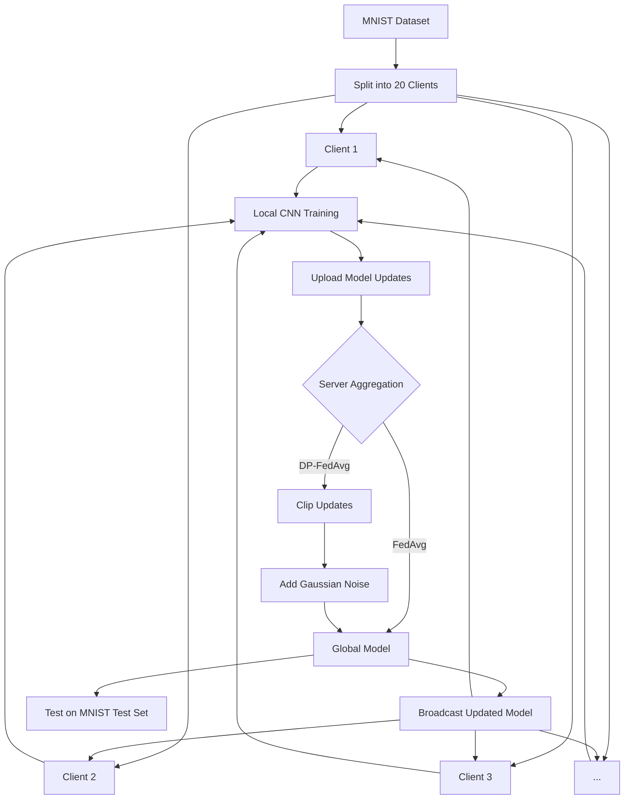

# 🔒 Privacy-Preserving Image Classification using Federated Learning and Differential Privacy

<p align="center">


</p>

A privacy-preserving image classification system built using **Federated Learning (FL)** and **Differential Privacy (DP)** on the **MNIST handwritten digit dataset**.

Instead of collecting users' data on a central server, this project simulates distributed client devices that train a shared Convolutional Neural Network (CNN) locally. The server aggregates only model updates using **Federated Averaging (FedAvg)** or **Differentially Private Federated Averaging (DP-FedAvg)**, ensuring that raw training data never leaves client devices.

The project also includes an **interactive Streamlit web application** for training, visualization, and handwritten digit prediction.

---

# 📑 Table of Contents

- Introduction
- Motivation
- Features
- Project Structure
- System Architecture
- CNN Model Architecture
- Experimental Setup
- Federated Learning Workflow
- Differential Privacy Workflow
- Training Process
- Experimental Results
- Privacy–Utility Trade-off
- Streamlit Dashboard
- Installation
- Running the Project
- Technologies Used
- Applications
- Future Scope
- References

---

# 📖 Introduction

Machine Learning models generally require collecting all user data into a centralized server before training. While this approach achieves high accuracy, it raises serious concerns regarding:

- Data privacy
- Unauthorized access
- Data leakage
- Regulatory compliance (GDPR, HIPAA)
- User trust

**Federated Learning (FL)** addresses these concerns by allowing multiple client devices to collaboratively train a shared model **without transmitting raw data**.

To further strengthen privacy, this project incorporates **Differential Privacy (DP)**, which protects client updates by clipping their influence and adding calibrated Gaussian noise before aggregation.

The result is a machine learning system capable of maintaining high prediction accuracy while significantly improving user privacy.

---

# 🎯 Project Objectives

The primary objectives of this project are:

- Implement Federated Learning for distributed image classification.
- Ensure that client data remains local throughout training.
- Protect model updates using Differential Privacy.
- Compare Standard Federated Learning with Differentially Private Federated Learning.
- Evaluate the impact of privacy mechanisms on model performance.
- Provide an interactive web interface for experimentation and prediction.

---

# ✨ Features

- ✅ Federated Learning simulation using multiple virtual clients
- ✅ Differentially Private Federated Averaging (DP-FedAvg)
- ✅ CNN-based handwritten digit classifier
- ✅ MNIST dataset support
- ✅ Streamlit web application
- ✅ Image upload and prediction
- ✅ Automatic grayscale preprocessing
- ✅ Real-time training progress visualization
- ✅ Comparison between Standard FL and DP-FL
- ✅ Accuracy and loss visualization

---

# 📂 Project Structure

```text
project/
│
├── app.py
├── main.py
├── README.md
├── requirements.txt
│
├── data/
│   ├── load_data.py
│   ├── preprocess.py
│   └── client_split.py
│
├── models/
│   └── cnn_model.py
│
├── training/
│   └── train.py
│
├── federated/
│   ├── aggregation.py
│   ├── federated_training.py
│   └── model_fn.py
│
├── evaluation/
│   ├── evaluate.py
│   └── plots.py
│
├── privacy/
│   └── dp_mechanism.py
│
└── utils/
    └── helpers.py
```

---

# 🏗️ System Architecture

The complete workflow consists of multiple simulated clients collaboratively training a global CNN model while keeping their local datasets private.



---

# 🔄 Overall Workflow

```text
          MNIST Dataset
                │
                ▼
      Data Preprocessing
                │
                ▼
      Split into 20 Clients
                │
                ▼
 Randomly Select 9 Clients
                │
                ▼
 Local CNN Training (1 Epoch)
                │
                ▼
 Upload Local Model Updates
                │
                ▼
 Server Aggregation
      ┌─────────────────────┐
      │     FedAvg          │
      │        OR           │
      │     DP-FedAvg       │
      └─────────────────────┘
                │
                ▼
 Updated Global Model
                │
                ▼
 Broadcast to Clients
                │
                ▼
 Final Evaluation on MNIST
```

---

# 🧠 Why Federated Learning?

Traditional machine learning centralizes all training data onto a single server, making it vulnerable to privacy breaches and regulatory challenges.

Federated Learning eliminates this requirement by ensuring that:

- Training data always remains on client devices.
- Only model parameters are exchanged.
- Multiple devices collaboratively improve a shared model.
- Sensitive information is never directly exposed to the server.

This decentralized training paradigm makes Federated Learning especially suitable for healthcare, finance, mobile devices, and other privacy-sensitive applications.

---

# 🧠 CNN Model Architecture

The classifier is built using a Convolutional Neural Network (CNN) defined in `models/cnn_model.py`. The network architecture is tailored for the MNIST dataset:

1. **Input Reshape Layer**: Reshapes the input from `(28, 28)` to `(28, 28, 1)` to add the grayscale channel dimension.
2. **Convolutional Layer (`Conv2D`)**: Extracts local spatial features using **32 filters** of size `(3, 3)` with `ReLU` activation.
3. **Max Pooling Layer (`MaxPooling2D`)**: Reduces spatial dimensions using a `(2, 2)` pool size, ensuring translation invariance.
4. **Flatten Layer**: Flattens the feature maps into a 1D vector.
5. **Dense (Fully Connected) Layer**: A `Dense` layer with **64 units** and `ReLU` activation.
6. **Output Layer**: A `Dense` layer with **10 units** and `softmax` activation representing digit classes `0-9`.

---

# 🔬 Experimental Setup

The model evaluation is configured with the following parameters:

* **Dataset**: MNIST digit dataset.
* **Total Clients ($N$)**: **20** simulated client devices.
* **Clients Sampled per Round ($K$)**: **9** clients participating in each aggregation round.
* **Communication Rounds**: **100** rounds.
* **Local Epochs**: **1** epoch of training per round per client.
* **Local Optimizer**: **SGD** with a learning rate of **0.02**.
* **Differential Privacy Parameters**:
  * **Noise Multiplier ($\sigma$)**: **0.05** (calibrated Gaussian noise)
  * **L2 Clip Norm ($C$)**: **1.0** (maximum L2 norm of client update gradients)

---

# 🛡️ Differential Privacy Workflow

Differential Privacy prevents model leakage by clipping updates and adding noise. During aggregation:

1. **Update Calculation**: The server calculates the client update relative to the global model:
   $$\Delta W_i = W_i - W_{\text{global}}$$
2. **Gradient Clipping**: The update is clipped to a maximum L2 norm of $C = 1.0$:
   $$\Delta W_i \leftarrow \Delta W_i \times \min\left(1, \frac{C}{\|\Delta W_i\|_2}\right)$$
3. **Noise Addition**: Calibrated Gaussian noise is added to the sum of updates:
   $$\Delta W_{\text{global}} = \frac{\sum_i \Delta W_i + \mathcal{N}(0, \sigma^2 C^2 I)}{K}$$
4. **Global Update**: The global model is updated with the perturbed average:
   $$W_{\text{global}} \leftarrow W_{\text{global}} + \Delta W_{\text{global}}$$

---

# 📊 Experimental Results

Below are the comparative evaluation results on a central MNIST test set after **100 rounds**:

| Configuration | Final Test Accuracy | Final Test Loss |
| :--- | :---: | :---: |
| **Standard Federated Learning** | **97.58%** | **0.0742** |
| **Differentially Private Federated Learning ($\sigma = 0.05$)** | **97.50%** | **0.0798** |

### ⚖️ Privacy–Utility Trade-off
Adding Differential Privacy ($\sigma = 0.05$) introduces a **negligible accuracy drop of only 0.08%** while providing mathematical guarantees against data extraction attacks.

---

# 🖥️ Streamlit Dashboard

The interactive Streamlit dashboard (`app.py`) provides:
* **Interactive Inference (Testing)**:
  * Upload an image from your device or capture one live using the webcamera.
  * **Automatic Grayscale Preprocessing**: Checks the input image mode. If colored, it automatically converts it to grayscale and resizes it to $28 \times 28$ before feeding it to the model.
  * Shows prediction metrics (Predicted Class, Confidence Score) and a bar chart of class probabilities.
* **Performance Visualizer**:
  * View pre-computed accuracy/loss line charts and full round-by-round logs comparing standard FL vs DP-FL.

---

# 🛠️ Installation & Running the Project

### 1. Set Up Virtual Environment
```powershell
python -m venv .venv
.\.venv\Scripts\Activate.ps1
```

### 2. Install Requirements
```powershell
pip install -r requirements.txt
```

### 3. Run the Dashboard
```powershell
streamlit run app.py
```

### 4. Run CLI Experiment Loop
To trigger a training experiment from the command line:
```powershell
python main.py --clients 20 --clients_per_round 9 --rounds 100 --noise_multiplier 0.05
```

---

# 🚀 Technologies Used
* **Python 3.x**
* **TensorFlow & Keras** (model training)
* **Streamlit** (interactive web dashboard)
* **Matplotlib** (training metric plots)
* **Pandas & NumPy** (data processing)

---

# 📖 References
* McMahan, B. et al., "Communication-Efficient Learning of Deep Networks from Decentralized Data", AISTATS 2017.
* Abadi, M. et al., "Deep Learning with Differential Privacy", ACM CCS 2016.
