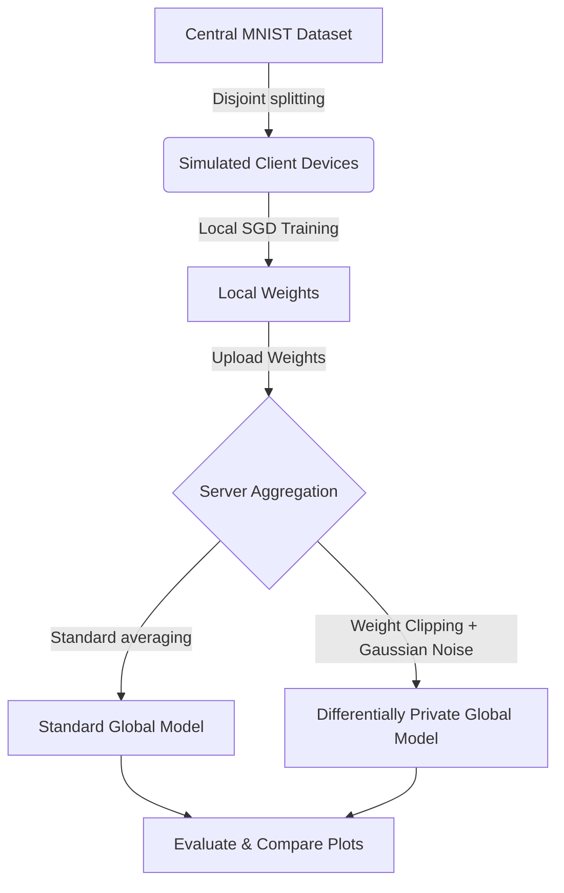

# Privacy-Preserving Image Classification using Federated Learning and Differential Privacy

This repository implements a **Privacy-Preserving Federated Learning (FL)** machine learning system with **Differential Privacy (DP)** for image classification. It is built using TensorFlow, Keras, and Streamlit, simulating a distributed machine learning environment across virtual clients while guaranteeing user data privacy.

---

## 🚀 Key Features

* **Federated Learning (FL):** Disjointly splits the training dataset to simulate independent client devices. Each client trains local weights on their local device without sending raw data to the central server.
* **Differential Privacy (DP):** Server aggregates local updates using Differentially Private Federated Averaging (`dp_fed_avg`). It clips local weight updates and adds calibrated Gaussian noise to prevent individual data reconstruction or membership inference attacks.
* **Interactive Streamlit Dashboard:** A web-based sandbox app (`app.py`) providing:
  * Real-time training progress tracking, including round-by-round indicators.
  * Image classification testing (upload an image or capture live via webcamera).
  * **Automatic Grayscale Conversion**: Validates incoming images; if they are colored, they are converted to grayscale and normalized before model prediction.
* **Fully IID Simulated Loops:** Baseline evaluation comparisons of standard Federated Averaging (FedAvg) vs. DP-FedAvg.

---

## 📂 Project Structure

```text
d:/coding/RAI/project/
├── app.py                      # Interactive Streamlit Web Application
├── main.py                     # CLI Script for Standard vs DP Federated Training
├── requirements.txt            # Python Dependencies
├── README.md                   # Consolidated Documentation (This file)
├── data/
│   ├── client_split.py         # Handles dataset splitting across simulated clients
│   ├── load_data.py            # Dataset loader (MNIST)
│   └── preprocess.py           # Preprocessing utilities
├── evaluation/
│   ├── evaluate.py             # Evaluation helper for central test accuracy/loss
│   └── plots.py                # Visual plotting comparisons (Accuracy and Loss)
├── federated/
│   ├── aggregation.py          # Implementations of fed_avg and dp_fed_avg algorithms
│   ├── federated_training.py   # TensorFlow Federated simulation process setup
│   └── model_fn.py             # Keras-to-TFF model wrapping
├── models/
│   └── cnn_model.py            # MNIST CNN Model architecture
├── privacy/
│   └── dp_mechanism.py         # Differentially Private Aggregator Factory
├── training/
│   └── train.py                # Simulated local client and server federated training loop
└── utils/
    └── helpers.py              # Environment check functions
```

---

## 🛠️ Setup and Installation

### 1. Create a Virtual Environment (Optional but Recommended)
On Windows (PowerShell):
```powershell
python -m venv venv
.\venv\Scripts\Activate.ps1
```

### 2. Install Dependencies
```powershell
pip install -r requirements.txt
```

---

## 💻 Running the Project

### Option A: Interactive Web Dashboard (Streamlit)
Launch the Streamlit app to interactively run training and test predictions with your webcam or device uploads:
```powershell
streamlit run app.py
```
Open **`http://localhost:8501`** in your browser.

### Option B: Command Line Interface (CLI)
Run standard FL vs. DP-FL side-by-side on MNIST:
```powershell
python main.py --clients 10 --clients_per_round 5 --rounds 15 --noise_multiplier 0.05
```
* **Parameters**:
  * `--clients`: Total virtual client devices.
  * `--clients_per_round`: Client sample count participating in aggregation per round.
  * `--rounds`: Communication rounds between clients and server.
  * `--noise_multiplier`: Standard deviation scale of Gaussian noise added to the aggregated weights.

---

## ⚙️ How It Works



1. **Simulating Clients (`data/client_split.py`)**: Split MNIST training data into $N$ disjoint sets. Data is shuffled to ensure IID distribution among clients.
2. **Local Training (`training/train.py`)**: In each communication round, the server samples $K$ active clients. These clients receive the global model weights, run local SGD for 1 epoch, and calculate updated weight matrices.
3. **Aggregating and Protecting (`federated/aggregation.py`)**:
   * **Standard FedAvg**: A simple element-wise average of client updates.
   * **DP-FedAvg**: Client updates are clipped to a maximum norm (to limit any single client's impact), aggregated, and then perturbed with Gaussian noise before updating the global model.
4. **Validation and Evaluation**: The final model weights are saved in `model.pkl` and evaluated using standard test sets. Comparison metrics are saved in `training_comparison.png`.

---

## 📄 Key Source Code Components

### MNIST CNN Architecture (`models/cnn_model.py`)
```python
import tensorflow as tf

def create_keras_model():
    """
    Creates a simple CNN model for MNIST digit classification.
    """
    model = tf.keras.models.Sequential([
        tf.keras.layers.Reshape(target_shape=(28, 28, 1), input_shape=(28, 28)),
        tf.keras.layers.Conv2D(32, kernel_size=(3, 3), activation='relu'),
        tf.keras.layers.MaxPooling2D(pool_size=(2, 2)),
        tf.keras.layers.Flatten(),
        tf.keras.layers.Dense(64, activation='relu'),
        tf.keras.layers.Dense(10, activation='softmax')
    ])
    return model
```

### Federated Aggregation Algorithm (`federated/aggregation.py`)
```python
import numpy as np

def fed_avg(client_weights_list):
    """
    Standard Federated Averaging (FedAvg) aggregation.
    """
    new_weights = []
    num_layers = len(client_weights_list[0])
    num_clients = len(client_weights_list)
    
    for layer_idx in range(num_layers):
        layer_weights = [client_weights_list[client_idx][layer_idx] for client_idx in range(num_clients)]
        mean_weights = np.mean(layer_weights, axis=0)
        new_weights.append(mean_weights)
        
    return new_weights

def dp_fed_avg(global_weights, client_weights_list, noise_multiplier, clip_norm=1.0):
    """
    Differentially Private Federated Averaging (DP-FedAvg) aggregation.
    Clips weight updates per client and adds calibrated Gaussian noise.
    """
    new_weights = []
    num_layers = len(global_weights)
    num_clients = len(client_weights_list)
    
    # Calculate updates (gradients) relative to current global weights
    client_updates = []
    for client_weights in client_weights_list:
        update = [client_weights[i] - global_weights[i] for i in range(num_layers)]
        client_updates.append(update)
        
    # Clip updates based on L2 norm
    clipped_updates = []
    for update in client_updates:
        # Calculate total L2 norm across all layers
        total_norm = np.sqrt(sum(np.sum(np.square(layer)) for layer in update))
        clip_factor = min(1.0, clip_norm / (total_norm + 1e-8))
        
        clipped_update = [layer * clip_factor for layer in update]
        clipped_updates.append(clipped_update)
        
    # Aggregate clipped updates and add Gaussian noise
    for layer_idx in range(num_layers):
        layer_updates = [clipped_updates[c][layer_idx] for c in range(num_clients)]
        sum_updates = np.sum(layer_updates, axis=0)
        
        # Add calibrated Gaussian noise relative to sensitivity and clip_norm
        noise_std = noise_multiplier * clip_norm
        noise = np.random.normal(0, noise_std, size=sum_updates.shape)
        
        # New global weight = old global weight + perturbed mean update
        perturbed_mean_update = (sum_updates + noise) / num_clients
        new_weights.append(global_weights[layer_idx] + perturbed_mean_update)
        
    return new_weights
```

### Dataset Loader (`data/load_data.py`)
```python
import tensorflow as tf

def load_mnist():
    """
    Loads the MNIST dataset from Keras.
    Returns:
        Tuple of (x_train, y_train), (x_test, y_test)
    """
    (x_train, y_train), (x_test, y_test) = tf.keras.datasets.mnist.load_data()
    return (x_train, y_train), (x_test, y_test)
```
